# 플래나이 (PLANAI)

> 마감·제출·취합 일정과 업무 메모를 한곳에서 관리하고, AI가 정리·검색·브리핑을 보조하는 로컬 우선(Local-first) 업무 플래너.

- 캘린더·메모·프로젝트·나의 기록을 한 화면 흐름으로 통합
- 데이터는 브라우저 IndexedDB에만 저장. 로그인·서버 계정 불필요
- AI 기능은 사용자가 지정한 LLM 엔드포인트로만 연결. 미연결 시에도 달력·노트·프로젝트는 정상 동작
- 웹앱(React 19 + TypeScript + Vite) 및 Chrome 확장(Manifest V3) 양쪽 빌드 지원

<p align="center">
  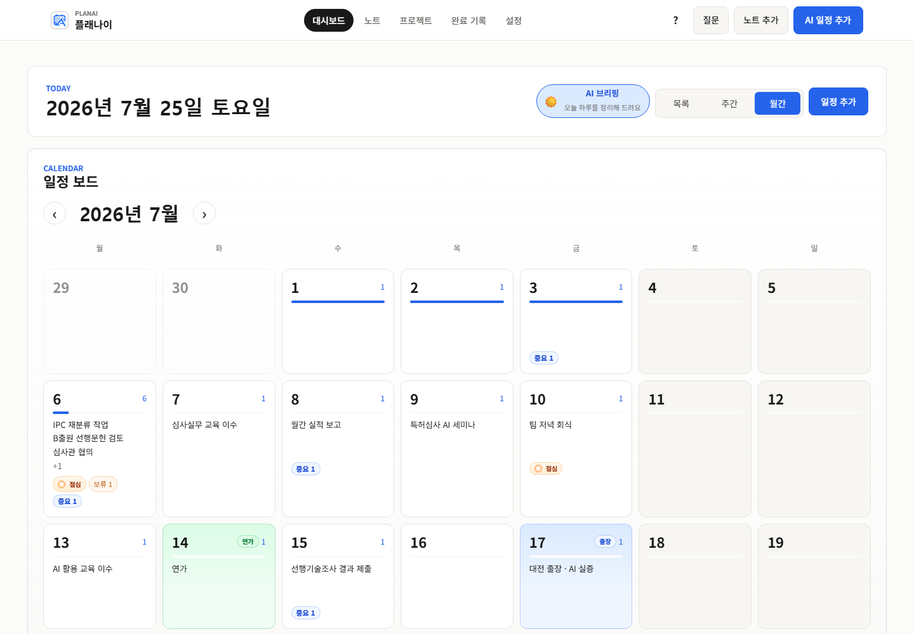
</p>

---

## 미리보기

### 자연어 일정 등록

입력 예시: `다음주 금요일까지 교육 이수 후 실적 제출` → 마감 날짜·시간이 채워진 초안 생성. 즉시 저장이 아닌 확인 후 반영 방식.

<p align="center">
  
</p>

입력 예시: `이번주 수요일 점심 김키포와` → 날짜·시간·일정 종류 자동 배정.

<p align="center">
  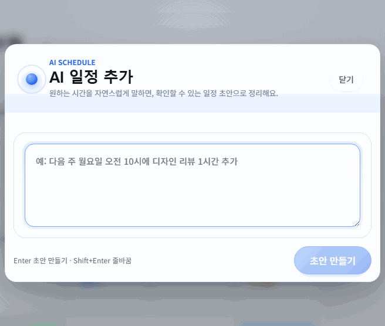
</p>

### 기간 일정

입력 예시: `다음주 월화수 서울 출장` → 시작·종료가 있는 일정 1건으로 생성. 달력에서는 해당 기간의 모든 날짜에 표시.

<p align="center">
  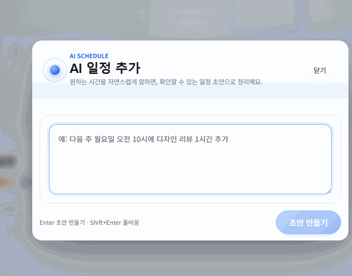
</p>

### 노트·일정 질의응답

노트와 일정 검색 후 답변 생성. 근거 항목 클릭 시 해당 화면으로 이동.

<p align="center">
  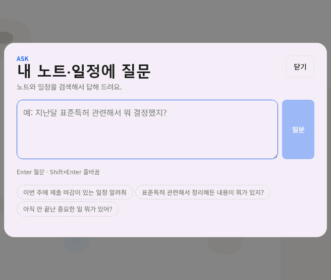
</p>

### 노트 연속 열람

카테고리 선택 시 해당 노트를 세로로 연속 표시. 체크박스는 목록에서 직접 토글.

<p align="center">
  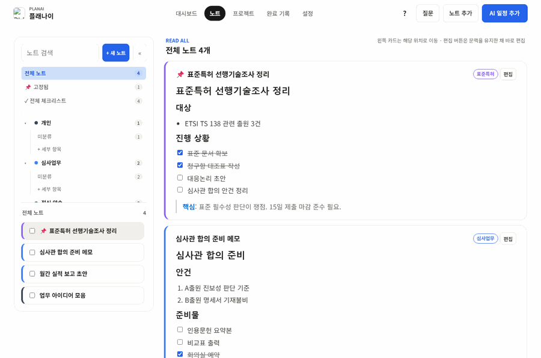
</p>

### 선택일 상태 필터

선택한 날짜의 일정을 미완료·보류·완료·취소별로 즉시 필터링.

<p align="center">
  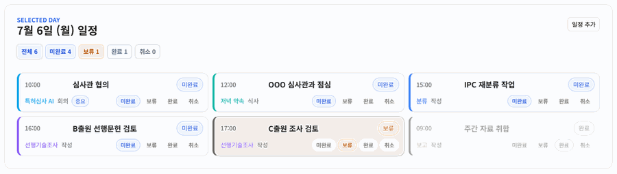
</p>

---

## 화면 구성

**대시보드 · 노트 · 프로젝트 · 나의 기록 · 설정** 5개 화면으로 구성. 상단 바에서 `질문`, `노트 추가`, `AI 일정 추가`(단축키 `A` 또는 `Ctrl+Shift+N`) 상시 호출 가능.

### 대시보드

월간 달력 중심 구성. **목록 · 주간 · 월간** 보기 전환(기본값 월간).

| 요소 | 동작 |
| --- | --- |
| 상태 구분 | 미완료는 프로젝트 색과 강조 테두리, 완료·취소는 저채도 처리 |
| 종류 표식 | 연가는 초록, 출장은 파랑으로 날짜 셀 강조. 점심·중요 별도 표식 |
| 선택일 목록 | 달력과 메모 사이에 해당 날짜 일정만 표시. 상태 배지가 필터로 동작 |
| 날짜 우클릭 | AI 일정 추가 / 직접 추가 / 연가 설정 |
| 일정 카드 우클릭 | 완료·보류·수정·AI 수정·복제·삭제 |
| 드래그 이동 | 일정 카드를 다른 날짜로 이동 |

- 지난 완료 일정은 기본 숨김. 설정에서 표시 전환 가능
- 당일 마지막 미완료·보류 일정 완료 시 축하 배너와 색종이 효과 표시. OS 애니메이션 축소 설정 시 정적 배너만 노출
- 데이터가 없는 상태에서는 첫 일정·첫 노트 생성 안내 우선 표시

### 노트

<p align="center">
  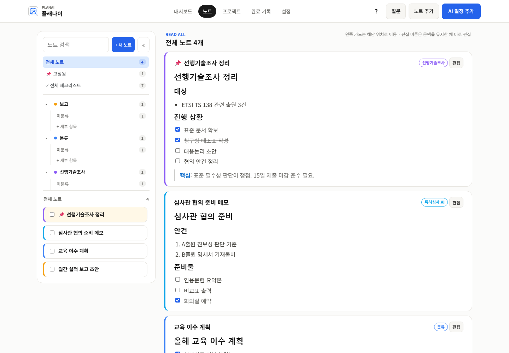
</p>

마크다운 노트를 프로젝트·세부 항목 단위로 관리. 왼쪽 탐색기에서 카테고리 선택 시 오른쪽에 해당 노트 연속 표시.

- **빠른 추가** — 상단 `노트 추가`는 제목 없이 본문만 입력. AI가 짧은 제목 생성(미연결 시 첫 문장을 대체 제목으로 사용)
- **제목 연동** — 편집기에서 제목이 본문 첫 줄을 자동 추적. 직접 수정 시점부터 고정
- **자동 분류** — 프로젝트·세부 항목 배정과 관련 노트 탐색을 백그라운드 처리
- **순서·저장** — 카드 드래그로 순서 변경. 다른 노트로 이동해도 편집 내용 자동 저장
- **일정 연결** — 노트와 일정 양방향 이동. 미완료 체크리스트 통합 조회
- **버전 관리** — 수동 저장·자동 저장·AI 편집 버전 비교 및 이전 내용 복원
- **보관** — 보관 노트는 별도 뷰로 분리

### 프로젝트

<p align="center">
  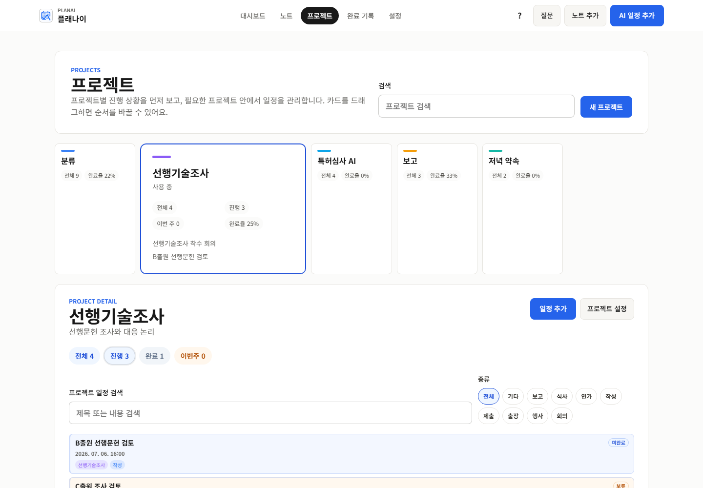
</p>

프로젝트별 전체·진행·이번 주·완료율 표시. 카드 드래그로 정한 순서는 일정 추가 모달의 프로젝트 목록에 동일 적용. 종류·상태 필터로 진행 지연 프로젝트 확인. 프로젝트 설명은 AI 도구 호출 시 맥락 정보로 함께 전달.

### 나의 기록

완료 이력을 재미있는 통계 중심으로 보여주는 기록 화면. 기간별 점심 메이트, 하루 최다 업무 완료·추가일, 최다 완료 프로젝트와 최근 1년 활동 그래프를 제공하며 최근 완료 일정 10개를 우선 표시. 전체 완료 기록은 접어서 검색할 수 있습니다.

점심 메이트 이름은 기계적으로 후보를 추린 뒤 AI가 `태정`과 `김태정`처럼 같은 사람으로 보이는 표기를 묶습니다. 이름 정리는 하루에 한 번 자동 실행되고 결과는 로컬에 저장됩니다.

---

## AI 기능

네이티브 function calling 비의존 방식. 프롬프트로 JSON 스키마와 도구 목록을 지시하고, 모델이 반환한 도구 호출을 앱이 로컬 실행한 뒤 결과를 첨부해 재요청(일정 에이전트 최대 5라운드, 라운드당 조회 도구 최대 3개). OpenAI 호환 엔드포인트 전반과 연결 가능하며 로컬 모델도 포함.

| 기능 | 내용 |
| --- | --- |
| AI 일정 추가 | 자연어 → 일정 초안 변환. 생성·수정·삭제 및 기존 일정 검색 지원. 반복 패턴은 재사용 규칙으로 제안 |
| 질문 | 노트·일정 검색 기반 답변. 근거 항목과 도구 호출 내역 표시 |
| AI 브리핑 | 당일 핵심, 지연·시간 충돌 주의사항, 관련 노트, 추천 행동 정리 후 노트로 저장 |
| 노트 편집 | 다듬기·요약·구조화·체크리스트 변환. 프롬프트는 설정에서 수정 가능 |
| 노트 → 할 일 | 노트 본문에서 실행 항목 추출 후 일정 등록 |

### 초안 확인 방식

<p align="center">
  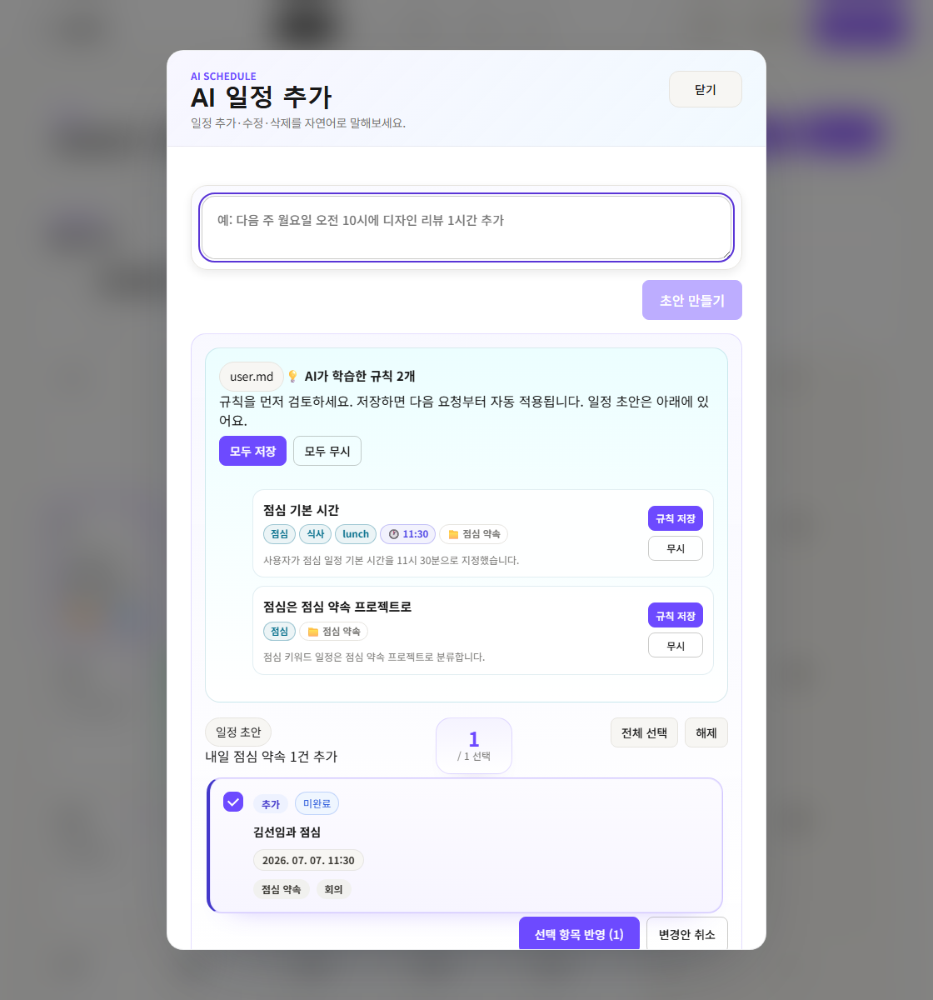
</p>

AI 응답은 즉시 저장되지 않음. 날짜·시간을 분리 표기한 초안 카드를 먼저 제시하고, 선택한 항목만 반영. 오등록 방지를 목적으로 한 구조.

반복 가능한 패턴은 **재사용 규칙**으로 함께 제안. 규칙 검토·저장 후 초안 반영 순서이며, 저장된 규칙은 `user.md`에 기록되어 이후 요청에 자동 적용.

```md
- 점심 일정은 시간이 없으면 11:30으로 설정한다.
- 제출 일정은 시간이 없으면 18:00을 시작 시각으로 설정하며, 별도 시간 범위가 없으면 종료 시각은 만들지 않는다.
- 점심·식사·밥이 들어가면 프로젝트는 점심 약속, 종류는 식사로 설정한다.
```

### 근거 표시

<p align="center">
  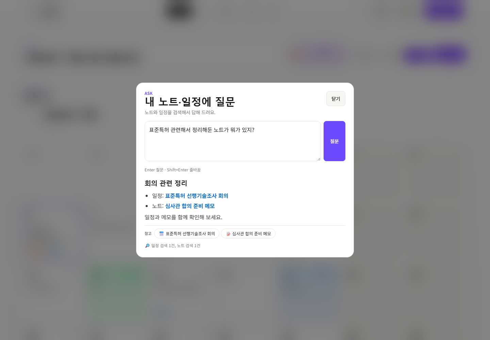
</p>

답변 하단 참고 칩 클릭 시 해당 노트·일정으로 이동. 🔎 줄에 실제 도구 호출 종류와 횟수 표시. 모델이 도구를 사용하지 않는 경우에도 답변이 가능하도록 매 요청에 노트·일정 제목 목록 동봉.

---

## 설정과 데이터

<p align="center">
  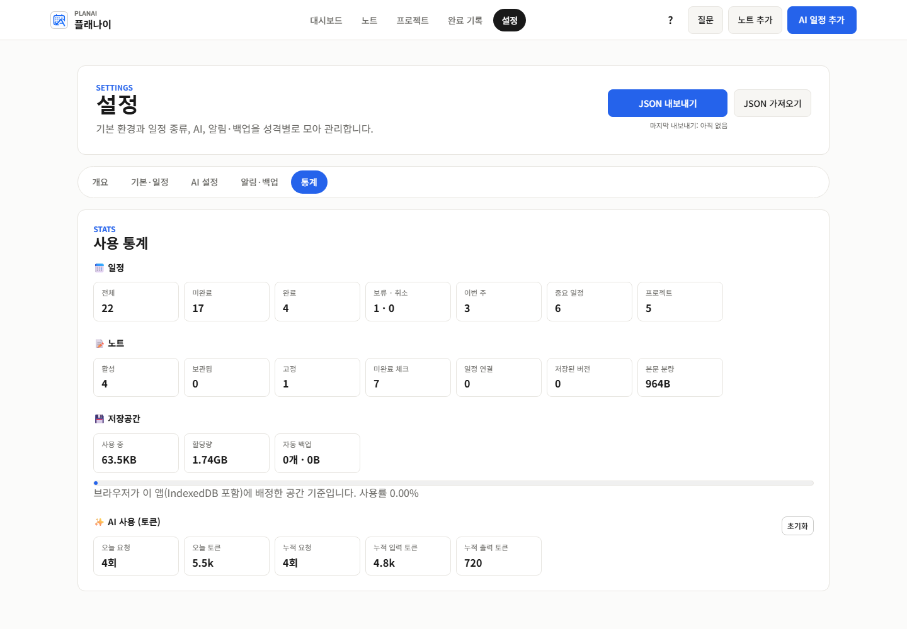
</p>

**개요 · 기본·일정 · AI 설정 · 알림·백업 · 통계** 5개 탭 구성.

| 탭 | 항목 |
| --- | --- |
| AI 설정 | 엔드포인트·모델·API 키, temperature, reasoning effort, 노트 AI 동작, `user.md` 개인 규칙 |
| 기본·일정 | 주 시작 요일, 시간 표시 형식, 지난 완료 일정 표시, 일정 종류 관리 |
| 알림·백업 | 일정 시작 전 알림(Chrome 확장, 클릭 시 대시보드 이동), 브라우저 내 자동 백업 보관·복원 |
| 통계 | 일정·노트 현황, 브라우저 배정 저장 공간, AI 토큰 사용량(당일·누적) |

- 토큰 수 미제공 서버는 문자 수 기반 추정치로 기록
- 전체 데이터는 JSON 내보내기·가져오기로 백업 및 이전
- 마지막 내보내기 이후 기간이 길어지면 주간 백업 알림 표시

---

## 시작하기

```bash
npm install
npm run dev          # http://localhost:5173
```

```bash
npm run build        # 타입 체크 + 확장 번들 (dist/)
npm run preview      # 프로덕션 미리보기
npm run typecheck    # 타입 체크만
npm run lint         # ESLint 검사
```

**Chrome 확장 설치** — `chrome://extensions` → 개발자 모드 활성화 → "압축해제된 확장 프로그램을 로드" → `dist` 폴더 선택.

**AI 연결** — 설정 → AI 설정에서 OpenAI 호환 엔드포인트와 API 키(필요 시) 입력. 로컬 모델도 엔드포인트 지정만으로 사용 가능. 미입력 시 AI 기능만 비활성.

---

## 기술 구성

| 영역 | 사용 기술 |
| --- | --- |
| 프론트엔드 | React 19, TypeScript, Vite |
| 라우팅 | React Router 7 (HashRouter) |
| 저장소 | Dexie(IndexedDB) v5 스키마, `useLiveQuery` 반응형 조회 |
| AI 연결 | OpenAI 호환 chat completions (SSE 스트리밍 + JSON 폴백) |
| 배포 | 웹 SPA / Chrome 확장(Manifest V3) |

상태 관리 라이브러리와 UI 프레임워크 미사용. 데이터는 Dexie 라이브 쿼리로 컴포넌트에 전달, 화면 상태는 React 훅으로 처리. 스타일은 CSS 디자인 토큰 기반 단일 `index.css`로 관리.

### 에이전트 구조

공용 인프라를 모든 에이전트가 공유.

- `agentTools.ts` — 읽기 전용 도구 실행기(일정·노트 검색/조회), 중복 호출 캐시, 결과 상한, 잘못된 인자에 대한 교정 피드백
- `agentUtils.ts` — 관대한 JSON 파싱, 표기 편차 흡수 도구 호출 파서(`tool`/`name`/`function.name` 등), 파싱 실패 시 1회 재시도
- `llmClient.ts` — 스트리밍 및 취소(AbortSignal) 지원, 요청별 토큰 사용량 기록

| 에이전트 | 역할 | 도구 |
| --- | --- | --- |
| `scheduleAgent` | 자연어 → 일정 초안, 재사용 규칙 | 일정 검색·조회, 프로젝트·종류 목록 |
| `qaAgent` | 노트·일정 질의응답 | 노트·일정 검색·조회 |
| `notesAgent` | 노트 편집·요약·통합, 관련 노트 탐색 | 노트·버전·연결 일정 조회 |
| `briefingAgent` | 하루 브리핑(단발 요청) | 없음 |
| `noteTitleAgent` | 빠른 추가 노트 제목 생성(단발 요청) | 없음 |
| `lunchMateAgent` | 점심 일정의 동일인 이름 묶기(일 1회 자동 실행) | 없음 |

### 프로젝트 구조

```
src/
├── agent/        # LLM 클라이언트, 6개 에이전트, 공용 도구·유틸
├── components/   # 재사용 UI (달력, 노트 에디터, AI 워크스페이스, 토스트 등)
├── context/      # AppDataContext — Dexie 기반 전역 데이터와 CRUD
├── pages/        # 대시보드 · 노트 · 프로젝트 · 나의 기록 · 설정
├── hooks/        # 다이얼로그 포커스, 백업 상태
├── utils/        # 날짜, 노트 제목, 일정 충돌, AI 사용량 등
├── db.ts         # Dexie 스키마
├── models.ts     # 도메인 타입
└── index.css     # 디자인 토큰 및 전체 스타일
```

### 문서용 자료

`docs/` 하위에 스크린샷·GIF 재생성용 스크립트 포함.

| 파일 | 용도 |
| --- | --- |
| `demo-seed.mjs` | 목업 데이터 생성. `demo-seed.json`(설정 → JSON 가져오기용)과 `demo-seed.dom.js`(IndexedDB 주입용) 출력. 날짜는 실행 월 기준 계산 |
| `demo-mock-llm.mjs` | 녹화용 목 LLM 서버. `MOCK_DELAY_MS`로 응답 지연, `MOCK_RULES=1`로 재사용 규칙 포함 |
| `make-gif.mjs` | 캡처 프레임을 GIF로 합성. 변경 픽셀만 기록하는 델타 프레임 방식 |
| `build-deck.mjs` | 소개용 슬라이드(pptx) 생성 |
