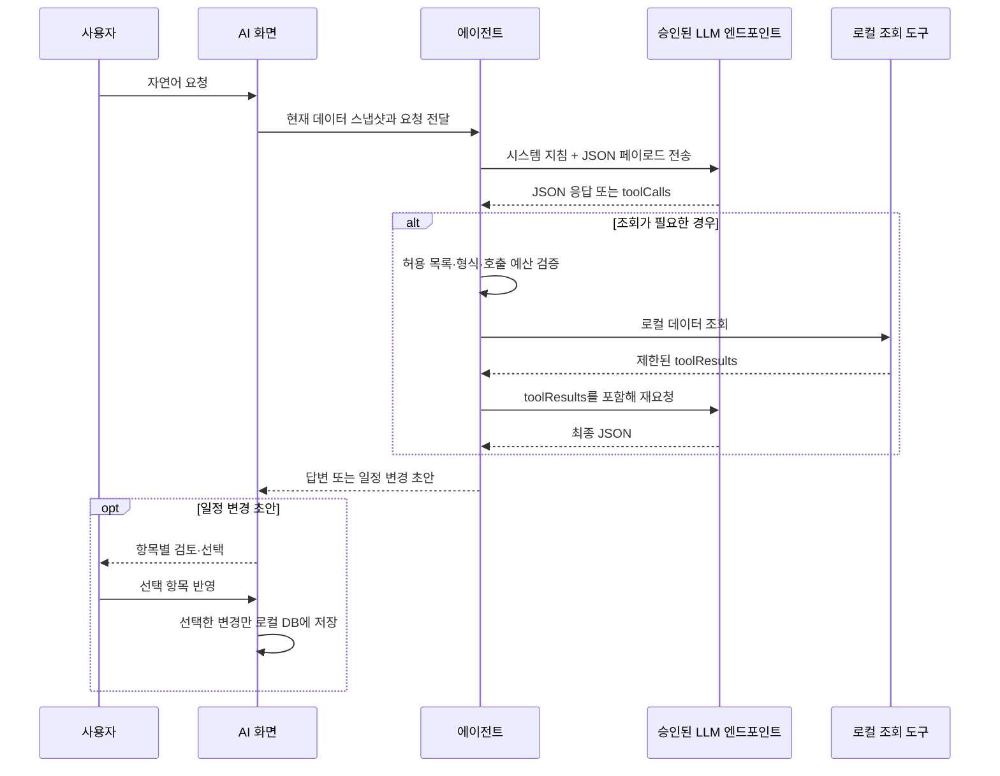

# Tool Calling 구현 현황

PLANAI의 AI 기능은 OpenAI 호환 Chat Completions API를 사용하지만, API의 네이티브 `tools`·`tool_choice` 필드는 전송하지 않습니다. 모델이 일반 텍스트 응답 안에서 약속된 JSON의 `toolCalls` 배열로 조회 요청을 선언하면, 앱이 이를 검증해 브라우저 메모리에 있는 데이터를 읽고 결과를 다음 LLM 요청의 `toolResults`에 넣는 **애플리케이션 관리형 Tool Calling** 방식입니다.

도구는 로컬 데이터 조회 전용이며, LLM 응답만으로 IndexedDB나 원격 서비스의 데이터를 바꾸지 않습니다. 일정 생성·수정·삭제는 도구가 아닌 변경 초안(proposal)으로 처리하고, 사용자가 검토 화면에서 선택해 반영할 때만 로컬 DB를 변경합니다.

## 동작 흐름



1. 에이전트는 현재 시각(`now`), 사용자 요청, 화면별 카탈로그와 누적 `toolResults`를 JSON으로 구성합니다.
2. 모델은 JSON 객체 하나를 반환합니다. 추가 데이터가 필요하면 최종 결과 필드를 비우고 `toolCalls`만 반환해야 합니다.
3. 에이전트가 도구명·인자·호출 수를 검증한 뒤 허용된 읽기 전용 도구만 실행합니다.
4. 결과는 크기를 제한해 다음 라운드에 전달합니다. 같은 도구와 의미상 같은 인자를 이전 라운드에 실행했다면 다시 실행하지 않습니다.
5. 최종 답변 또는 일정 초안은 UI가 표시합니다. 일정 초안은 사용자의 명시적 선택 전에는 적용되지 않습니다.

## LLM 요청과 JSON 계약

LLM 클라이언트는 `model`, `messages`, `stream`, `temperature`, `max_tokens`만 포함한 Chat Completions 요청을 만듭니다. 필요할 때 `reasoning_effort`를 추가하고, Gemma 4 26B MoE 모델에는 `chat_template_kwargs.enable_thinking`(활성화 시 `skip_special_tokens: false`)을 더합니다. 진행 콜백이 있으면 SSE 스트리밍을 요청하고, 그렇지 않으면 일반 JSON 응답을 받습니다.

현재 연결 대상은 빌드 프로필의 승인된 MOIP Chat Completions 주소로 고정됩니다. 임의의 OpenAI 호환 엔드포인트나 로컬 서버 주소는 설정값으로 전달해도 거부됩니다. 요청은 쿠키를 보내지 않고(`credentials: "omit"`), 리퍼러를 보내지 않습니다.

응답 본문은 JSON 객체여야 합니다. 코드 펜스나 앞뒤 텍스트가 섞였을 때는 객체 부분을 추출해 파싱을 시도하며, 실패하면 원문 일부와 함께 JSON만 반환하라는 안내를 붙여 한 번 더 요청합니다. 재시도 후에도 실패하면 각 에이전트는 예외 대신 안전한 안내 결과를 반환합니다.

표준 조회 요청은 다음과 같습니다.

```json
{
  "toolCalls": [
    {
      "tool": "search_tasks",
      "args": { "keyword": "팀 회의", "date": "2026-07-20", "limit": 10 }
    }
  ]
}
```

도구 결과는 다음 라운드의 사용자 페이로드에 포함됩니다.

```json
{
  "tool": "search_tasks",
  "args": { "keyword": "팀 회의", "date": "2026-07-20", "limit": 10 },
  "ok": true,
  "result": [{ "id": "...", "title": "팀 회의", "startAt": "..." }]
}
```

### 에이전트별 호출 형식과 예산

| 에이전트 / 화면 | 허용 도구 | 파싱 형식 | 최대 라운드 / 라운드당 호출 |
| --- | --- | --- | --- |
| 일정 AI (`scheduleAgent`) | `list_projects`, `list_task_types`, `search_tasks`, `get_task` | `toolCalls`의 엄격한 `tool` / 객체형 `args` | 5 / 3 |
| 데이터 질문 (`qaAgent`) | `search_notes`, `get_note`, `search_tasks`, `get_task` | `toolCalls`, `tool_calls`, `actions`; `tool`·`name`·`tool_name`·`function.name` 및 여러 인자 별칭 호환 | 3 / 2 |
| 노트 AI (`notesAgent`) 검색 모드 | `search_notes`, `get_note`, `list_note_versions`, `get_linked_tasks` | `toolCalls`의 엄격한 `tool` / 객체형 `args` | 3 / 2 |
| 브리핑·빠른 노트 제목 | 없음 | 해당 없음 | 해당 없음 |

데이터 질문은 세 번째 라운드에서 이미 조회 결과가 있으면 추가 도구 호출을 막고, 지금까지의 결과로 답변을 작성하라고 알립니다. 일정·노트 AI는 라운드 예산을 초과하면 조회를 완료하지 못했다는 안내로 종료합니다. 따라서 모델은 가능한 한 적은 호출로 한 라운드에 필요한 조회를 묶어야 합니다.

노트 AI의 도구는 `search` 모드에서만 활성화됩니다. 편집·인라인 편집·요약·병합은 전달된 노트 본문만으로 처리합니다.

## 도구 상세

### 일정·프로젝트 도구

| 도구 | 인자 | 동작 및 반환값 |
| --- | --- | --- |
| `list_projects` | 없음 | 모든 프로젝트의 `id`, 이름, 설명, 활성 여부를 반환합니다. 일정 프롬프트에는 동일한 프로젝트 선택지가 미리 들어가므로 보통은 별도 호출이 필요 없습니다. |
| `list_task_types` | 없음 | 모든 일정 종류의 `id`, 이름, 활성 여부를 반환합니다. |
| `search_tasks` | `keyword` 또는 `title`, `status`, `date`, `startDate`, `endDate`, `projectId`, `limit` (모두 선택) | 제목·내용·프로젝트·종류를 검색합니다. 날짜 조건이 있으면 시작 시각 오름차순, 없으면 수정 시각 내림차순이며, 일정 요약과 프로젝트·종류 이름을 반환합니다. |
| `get_task` | `taskId` 필수 | 일정 상세를 반환합니다. 내용은 검색 결과보다 길고, 프로젝트 설명과 `updatedAt`을 포함합니다. |

`search_tasks.status`는 `NOT_DONE`, `ON_HOLD`, `DONE`, `CANCELED`와 일반적인 영문·한국어 별칭을 받습니다. 날짜는 `YYYY-MM-DD` 및 `YYYY/M/D`·`YYYY.M.D` 형식을 정규화해 사용하며, 해석하지 못한 날짜·상태 필터는 경고와 함께 무시합니다.

### 노트 도구

| 도구 | 인자 | 동작 및 반환값 |
| --- | --- | --- |
| `search_notes` | `keyword`, `projectId`, `tag`, `status`, `limit` (모두 선택) | 제목·본문·태그·프로젝트 이름을 검색하고, 최근 수정 순으로 노트 요약을 반환합니다. `status`는 `draft`, `active`, `archived`만 허용합니다. |
| `get_note` | `noteId` 필수 | 제목·본문·프로젝트·태그·상태·연결 일정 ID와 `updatedAt`을 반환합니다. 본문이 길면 잘림 여부도 함께 반환합니다. |
| `get_linked_tasks` | `noteId` 필수 | 노트에 연결된 일정의 ID, 제목, 시작 시각, 상태를 반환합니다. |
| `list_note_versions` | 없음 | 버전 이력은 현재 노트 UI가 관리합니다. 실제 버전 목록을 읽지 않고, 히스토리 패널을 이용하라는 안내만 반환합니다. |

`execCurrentDatetime`은 ISO 현재 시각을 반환하는 공용 실행 함수이지만 어느 에이전트의 허용 목록에도 노출되지 않습니다. 현재 시각은 모든 해당 페이로드의 `now` 필드로 이미 전달합니다.

## 제한과 보안 경계

| 항목 | 현재 구현 |
| --- | --- |
| 허용 목록 | 에이전트별 도구 이름을 고정합니다. 알 수 없는 이름은 실행하지 않습니다. 데이터 질문만 제공자별 호출 표기 차이를 유연하게 해석합니다. |
| 인자 검증 | 필수 ID를 검사하고, 검색 `limit`은 기본 15·최소 1·최대 30으로 보정합니다. 잘못된 검색 필터는 오류 또는 경고 결과로 모델에 돌려보냅니다. |
| 중복 방지 | 도구명과 키 정렬 인자로 캐시합니다. 이전 라운드의 동일 호출은 생략하고 `system_notice`로 기존 결과 사용을 지시합니다. |
| 결과 크기 | 일정 검색 본문은 160자, 일정 상세 본문은 500자, 노트 검색 미리보기는 200자, 노트 상세 본문은 4,000자로 제한합니다. 다음 라운드에는 최근 결과 최대 16건과 결과 직렬화 기준 약 12,000자만 전달하며, 초과분은 잘림 안내로 대체합니다. |
| 프롬프트 인젝션 방어 | 카탈로그·사용자 작성 노트·도구 결과를 신뢰할 수 없는 데이터로 선언하고, 그 안의 지시를 따르지 않도록 시스템 프롬프트에 명시합니다. |
| 변경 안전성 | 모든 도구는 읽기 전용입니다. 일정 작업은 초안으로만 반환되며, 삭제 초안은 검토 UI에서 기본 선택되지 않습니다. |
| 오래된 초안 | 프롬프트는 도구로 찾은 수정·삭제 대상의 `updatedAt`을 `expectedUpdatedAt`에 복사하도록 요구합니다. 값이 포함된 초안은 반영 직전에 현재 `updatedAt`과 비교해 불일치 시 거부합니다. 모델이 이 값을 생략한 초안에는 이 낙관적 동시성 검사가 적용되지 않습니다. |
| 전송·응답 제한 | 요청은 최대 64개 메시지·총 250,000자, 모델 응답은 최대 1MB로 제한합니다. 요청 전체 제한은 60초, 스트림 무응답 제한은 15초이며 동시 LLM 요청은 2개까지입니다. |
| 취소·오류 | `AbortSignal`을 요청에 전달합니다. HTTP 오류, 빈 응답, 응답 크기 초과, JSON 파싱 실패는 사용자에게 안전한 오류 메시지로 처리합니다. |

데이터 질문은 모델이 `answer`와 `toolCalls`를 함께 반환하는 경우에도 답변 텍스트를 보존합니다. 다만 프롬프트 계약은 조회 요청과 최종 답변을 분리하므로, 새 구현도 이 계약을 유지해야 합니다.

## 일정 초안의 사용자 반영

일정 AI의 `create_task`, `update_task`, `delete_task`는 `proposal.operations` 안의 데이터 구조입니다. 도구 호출이 아니며 모델이 직접 실행할 수 없습니다.

- 생성·수정 항목은 기본 선택되고, 삭제 항목은 명시적 동의를 위해 기본 선택되지 않습니다.
- 선택된 각 항목을 독립적으로 적용하므로 일부 실패가 나도 나머지 성공 항목은 유지됩니다.
- 프로젝트·일정 종류·대상 일정의 존재를 반영 직전에 다시 확인합니다.
- 사용자는 적용 전에 항목별 선택을 바꾸거나 전체 초안을 취소할 수 있습니다.

## 구현 파일

| 파일 | 역할 |
| --- | --- |
| [`src/agent/llmClient.ts`](../src/agent/llmClient.ts) | 승인된 엔드포인트 검증, Chat Completions 요청, SSE 처리, 요청·응답 크기/시간 제한 |
| [`src/agent/agentUtils.ts`](../src/agent/agentUtils.ts) | JSON 복구·1회 재시도, 유연한 데이터 질문 호출 파싱, 호출 수 제한 |
| [`src/agent/agentTools.ts`](../src/agent/agentTools.ts) | 공용 읽기 전용 조회 실행기, 인자 검증, 결과 축소, 중복 캐시 |
| [`src/agent/scheduleAgent.ts`](../src/agent/scheduleAgent.ts) | 일정 AI의 5라운드 도구 루프와 변경 초안 파싱 |
| [`src/agent/qaAgent.ts`](../src/agent/qaAgent.ts) | 데이터 질문의 3라운드 도구 루프와 참고 자료 검증 |
| [`src/agent/notesAgent.ts`](../src/agent/notesAgent.ts) | 노트 검색 모드의 3라운드 도구 루프 |
| [`src/components/AiAssistantWorkspace.tsx`](../src/components/AiAssistantWorkspace.tsx) | 일정 초안의 항목별 검토, 동시성 확인, 선택 반영 |

## 확장 시 체크리스트

- 실행 함수뿐 아니라 에이전트 허용 목록, 프롬프트 스키마, 호출 파서, UI 노출 문구, 예산을 함께 갱신합니다.
- 쓰기 동작은 도구로 직접 추가하지 말고, 일정 초안처럼 사용자 검토와 반영 단계로 분리합니다.
- 새 도구의 반환값은 최소 권한·최소 데이터 원칙을 지키고, 길이 제한과 잘림 표기를 추가합니다.
- 도구 계약·라운드 예산·응답 파서가 바뀌면 이 문서와 호환성 테스트를 함께 갱신합니다.
